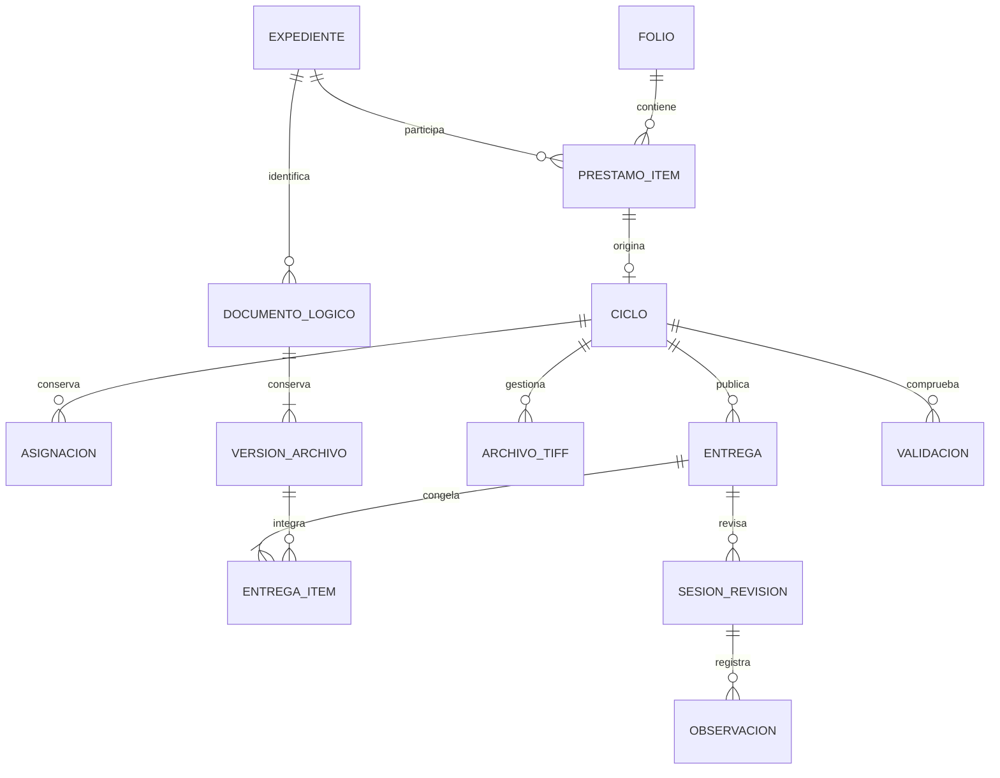

# Modelo operativo y arquitectura 0.5.0

Documento de referencia del código implementado. La bitácora registra decisiones y resultados; el manual describe la operación. La base local de desarrollo no contiene la información productiva de Windows 7.

## Identidades y relaciones

`expedientes` es el maestro único por CURP normalizada + legajo. `folios` representa el lote/préstamo; `prestamo_items` conserva identidad esperada y recibida, discrepancia, validador, ubicación y devolución. `trabajos` mantiene su nombre e ID anteriores y ahora representa el ciclo. El mismo maestro puede participar en distintos folios; cada contexto crea otro ciclo. No se cambia el folio de un ciclo existente. Una recepción parcial conserva los elementos pendientes, faltantes y no relacionados.

La pantalla principal agrupa por maestro y muestra su ciclo preferido vigente. Los ciclos históricos permanecen en Registros asociados y Expediente 360; filtrar por un folio anterior no cambia el ciclo principal. No se suman automáticamente sus conteos ni documentos. Las asignaciones finalizadas y colaboradores permanecen en `asignaciones`; reasignar no borra al operador anterior.

## Estados independientes

| Dimensión | Registro y regla |
|---|---|
| Custodia | `prestamo_items.custodia`: registrado, discrepancia, préstamo abierto, devolución y aceptación física. La aprobación digital no devuelve el expediente. |
| Proceso | `trabajos.estado` e `historial_estados`: recepción, conteo, escaneo, codificación, revisión, corrección y cierre. Cierre exige aprobación de entrega. |
| Calidad | `trabajos.calidad`, sesiones y observaciones. Una edición invalida la validación; nunca resuelve por sí misma una observación. |
| Archivo | Actividad de `archivos_tiff` y ciclo de vida de documento/versión; retiro conserva original, revisiones y entregas anteriores. |

El Kanban deriva cinco columnas de esas reglas. Nota, prioridad, etiqueta, bloqueo y fecha objetivo no son otro estado. Una aprobación que perdió validación vigente vuelve a señalar necesidad de revisión, conservando su historia.

## TIFF e integridad

Cada documento tiene UUID (`documento_id` / `document_asset_id`) independiente del nombre y del SHA-256. Cada contenido conservado tiene UUID de versión (`version_id` / `file_version_id`), hash, tamaño, páginas y vínculo con su antecesora. Un reescaneo completo puede sustituir el contenido conservando el documento lógico; su importación provisional queda trazable. Renombrar o recodificar conserva la identidad. La detección de contenido idéntico no borra ni fusiona documentos. Importación ordinaria omite duplicados exactos; adopción histórica permite conservarlos explícitamente.

Las copias de trabajo mantienen nombres compatibles con el flujo anterior. Las entregas usan `CODIGO__SECUENCIA__UUIDCORTO.tif`, por ejemplo `DP-01__001__A1B2C3D4E5F6.tif`; el formato exacto procede de `assets.canonical`. Los nombres originales desconocidos en registros antiguos permanecen sin dato.

Cada entrega crea una carpeta independiente `datos/entregas/CURP_Ln_Cciclo_ENTREGA_000n`. Nunca se combina con otra. `manifest.json` incluye maestro/ciclo, autor/fecha, advertencias y el inventario exacto: documento, versión, nombre original/canónico/de trabajo, código, carpeta, SHA-256, bytes, páginas, modalidad y actividad. `entrega_items` conserva las FK normalizadas. El estado del manifiesto refleja su publicación; el posterior resultado de revisión pertenece a la base.

`manifest_hash` cubre el JSON canónico completo; `inventario_hash` cubre solo los elementos y permite comparar inventarios entre números/fechas distintos. No son una firma digital. El diff usa UUID y distingue agregado, retirado, sustituido, renombrado, recodificado, movido o sin cambios. El verificador externo puede comprobar archivos y estructura sin abrir SQLite; con el hash esperado también contrasta el manifiesto con el registrado en origen.

## Validación y revisión

La validación devuelve `OK`, `OK con advertencias`, `REQUIERE REVISIÓN` o `BLOQUEANTE`. Examina integridad del original/versión/copia actual, páginas, códigos, ubicación, colisiones, residuos, duplicados y operaciones/reescaneos pendientes. Para aprobación añade recepción física confirmada, conteo, conciliación histórica e incidencias/observaciones bloqueantes. Una huella de los datos relevantes detecta obsolescencia, incluidas ediciones externas. Aprobar vuelve a validar y exige que el inventario coincida con la entrega más reciente.

Las observaciones apuntan a sesión/entrega exactas, documento/versión y opcionalmente página/hoja física. El flujo explícito es Abierta → En corrección → Resuelta con entrega posterior → Validada por revisor. Anular o reabrir requiere motivo y conserva historial. Abrir evidencia consulta el TIFF de la entrega original, aunque el archivo de trabajo ya haya cambiado.

Organizar genera reporte y entrega a partir del inventario gestionado. Preparar entrega desde 360 también vincula las métricas al ciclo. Las carpetas incompletas quedan marcadas; el siguiente intento usa otro número. La aprobación no borra validaciones ni revisiones previas.

## Importación histórica y Excel

`LegacyImport.preflight` recorre una carpeta CURP sin modificarla ni escribir SQLite, no sigue enlaces y decodifica una página TIFF a la vez. Comprueba estructura, PERSONALES/FEDERAL, catálogo, nombres, duplicados, colisiones e ilegibles. No interpreta un TIFF ilegible como cero páginas. El registro externo conserva el diagnóstico sin adoptar archivos. Adoptar crea copias verificadas, registra su correspondencia en `importacion_items` y permite reanudar una adopción interrumpida sin duplicar las copias registradas. Un cambio en fuente/catálogo obliga a repetir el análisis.

Si no existe folio acreditado, un ciclo legado usa una agrupación técnica identificada como `LEGADO-SIN-FOLIO-…`; no acredita recepción física ni inventa su fecha. El Excel mantiene `origen` y procedencia por fila, `No_digitales` como declaración y diferencias por conciliar. No se deducen legajo ni fechas ausentes. Solo se analizaron fixtures sintéticos y encabezados ya soportados; no estuvieron disponibles los Excel privados originales.

## Capas y archivos para localizar cambios

| Módulo | Responsabilidad |
|---|---|
| `main.py`, `workspace.py` | Entrada, diagnóstico de lectura, raíz aislada y bloqueo |
| `core.py`, `schema.sql` | Store, ciclos heredados, conteos, incidencias, catálogos, auditoría |
| `migrations.py`, `operational_migration.py` | Migraciones transaccionales y enlace conservador de IDs anteriores |
| `operations.py`, `operational_schema.sql` | Maestro, recepción, custodia, asignación e historial |
| `coding.py`, `coding_v3.py`, esquemas TIFF | Importación, editor, reescaneo, diarios y recuperación |
| `assets.py`, `assets_schema.sql` | UUID, versiones binarias y migración de identidad TIFF |
| `delivery.py`, `delivery_schema.sql` | Validador, publicación, manifiestos, diff y exportación exacta |
| `review.py` | Sesiones, observaciones, respuesta, validación y aprobación |
| `legacy.py`, `legacy_schema.sql` | Preflight, registro externo, adopción y reanudación |
| `reporting.py` | 360/HTML, tarjetas derivadas, datasets CSV y hechos JSON |
| `ui.py`, `operational_ui.py` | Formularios Tk y visor de evidencia de solo lectura |
| `backup.py`, `manifests.py` | Respaldo/restauración, hashes, rutas y archivos permitidos |
| `actualizar.py`, `release.py` | Resguardo y sustitución exclusivamente de código |

## Migraciones y conservación

Núcleo actual **6**, esquema TIFF **3**. Núcleo 3 incorpora maestros/préstamos/asignaciones; 4 incorpora UUID/versiones; 5, entregas/revisión/validación; 6, correspondencia de adopciones. Se conserva cada ID previo de trabajo, TIFF, conteo y revisión. Los ciclos históricos ambiguos se marcan por conciliar sin fusionar archivos. Las asignaciones heredadas tienen fecha inicial desconocida.

La migración 4 reconstruye `archivos_tiff` para retirar la unicidad antigua por hash, copiando sus columnas e IDs y comprobando FK. Rechaza columnas adicionales desconocidas en vez de omitirlas. Es un cambio controlado de tabla dentro de la migración, no un borrado de documentos. Hay snapshot SQLite previo, transacción y pruebas de rollback. Abrir código antiguo sobre una base migrada no es una reversión válida.

## BI, límites y futura API

La exportación incluye maestros, préstamos/items, ciclos, asignaciones, documentos/versiones, entregas/items, validaciones, revisiones/observaciones e historial, importaciones y eventos. `hechos_operativos.json` agrega inventario activo del ciclo vigente, recepción, calidad, diferencias declaradas, correcciones, reescaneos y duraciones con cobertura. No suma cada snapshot; denominador cero o inicio no confiable producen dato desconocido. Un registro técnico de importación no demuestra la duración real del trabajo antiguo.

Los servicios operativos aceptan un rol para separar acciones de recepción, digitalización y revisión. La aplicación de escritorio sigue siendo de un operador local, con rol responsable predeterminado. No existe autenticación, autorización de red ni firma inviolable; una futura API deberá añadirlas y envolver también las rutas heredadas de Store/CodingService. No se implementa un servidor ni multiusuario simultáneo.

El proceso TIFF conserva páginas y evita cargar todo el lote en memoria. Hashes, validación y copia son síncronos: en 3 GB el tiempo debe medirse con muestras representativas. Las versiones y entregas independientes aumentan el espacio usado; no se implementa purga automática. Windows 7/Python 3.8.10 requieren el ensayo físico documentado.
